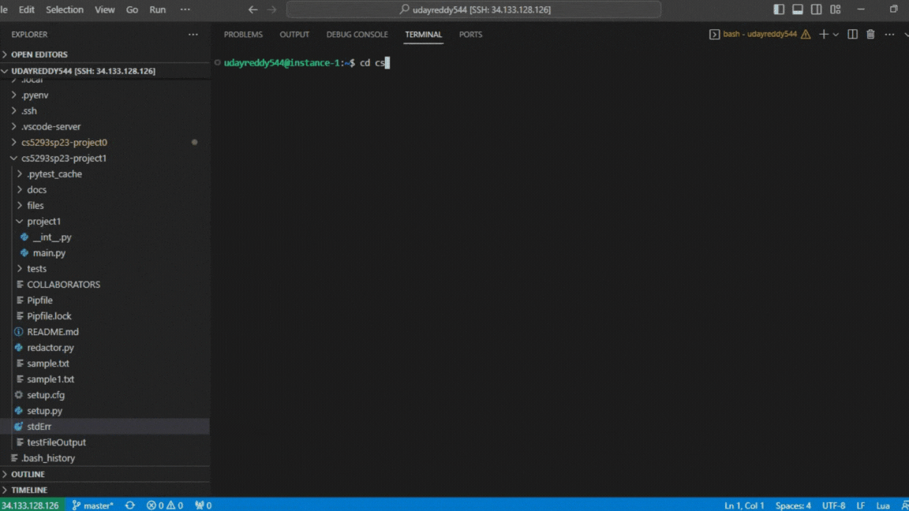
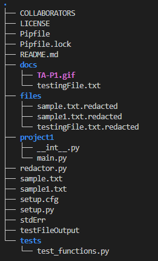

## masking sensitive nformation    
##### Installation  
pyenv install 3.10.1  
pyenv global 3.10.1  
pip install --upgrade pip  
##### Running  
- python redactor.py --input '*.txt' --names --dates --phones --genders --address --output 'files/' --stats 'stdErr'
- pipenv run python -m pytest (to run test cases)

#### Packages   
- pytest
- spacy
#### Folders  
- tests -- contains test functions
- docs -- containd gif and testingFile.txt used for testing purpose
- project1 -- contains main.py file
- files -- contains output files
#### Recording


#### Tree structure 



#### Assumptions 

The names and address are redacted using the spacy package, for remaining fields like phones, genders, dates are redacted using the regex. To load the nlp, I used the en_core_web_sm and my initial testing reveled that address redaction is not accurate as predicted.

#### Issues Expected

In the address redaction, only the names of ststes and cities are being redacted using the spacy module,the imporatant part of the address that is sensitive is pincode, the pincode is not identied by the spacy,to identify the pincode I have written a regex pattern and extracted the pincodes.


#### Important Files
main.py -contains the functions for redaction of names, phones, genders, address
redactor.py -contains the code for parsing arguments and also a function to save the files of readcted files.

#### functions in main.py

##### input_redaction(file,args):

file - file to be redacted 
args - command line arguements passed from redactor file.
This function reads the file and passes the text to the functions  according to the value of the input redaction flags and passes the text to names_redact(), phone_redact(), phone_redact(),address_redact(),gender_redact() on the basis of the redaction flags and finally the redcated text and data structure status is passed to calling function from the redactor.py.

##### name_redact(txt_str,status)

txt_str -- text to be redacted  
status array -- data structure that contains list of the dictionaries that keep track of the masked names and count of the redacted items.
This function uses the spacy that generates the token, and later I compared the entity type of token, if the entity type is PERSON, then the token is redacted and added to the dictionary in the status list and this redacted text and updated status is passed to the next function or calling function according to redaction flags.

##### phone_redact(txt,status)

txt -- text to be redacted  
status -- data structure that contains list of the dictionaries that keep track of the masked phones and count of the redacted items
This function uses the regular expressions to retrieve the phones

```
regular expression used = (\(\d{3}\)\s\d{3}-\d{4}|[+]?[\d{1,2}]?[\-\s\(]{1}?\d{3}[\-\s\)]{1}?\d{3}[\-\s]{1}?\d{4})
```

 The redacted phone numbers are masked and added to the status list that contains dictionaries.The redacted text and the status list are returned and later passed to another subsequent function or calling function according to redaction flags.


##### dates_redact(txt,status)

txt -- text to be redacted  
status -- data structure that contains list of the dictionaries that keep track of the masked dates and count of the redacted items
This function uses the regular expressions to retrieve the dates.
```
regular expression used = (\d{1,2}\s[a-zA-Z]{1,8}\s\d{2,4}|\d{1,2}/\d{1,2}/\d{2,4}|[JFMASOND]{1}[a-z]{2,9}\s\d{1,2},\s\d{1,4}|January\s\d{1,2}|February\s\d{1,2}|March\s\d{1,2}|April\s\d{1,2}|May\s\d{1,2}|June\s\d{1,2}|July\s\d{1,2}|August\s\d{1,2}|September\s\d{1,2}|October\s\d{1,2}|November\s\d{1,2}|December\s\d{1,2})
```
This function uses the regular expressions to match and retrieve the dates, The redacted dates are masked and added to the status list that contains dictionaries.The redacted text and the status list are returned and later passed to another subsequent function or calling function according to redaction flags.

##### address_redact(txt_str,status)

txt -- text to be redacted  
status -- data structure that contains list of the dictionaries that keep track of the masked addresses and count of the redacted items

This function uses the spacy that generates the token, and later I compared the entity type of token, if the entity type is GPE or LOC, then it is taken as address and the matched tokens are masked in text and added to the status list that contains dictionaries.
Along with the spacy, regex is also used to get the pincodes because the spacy is not able to identify the pincodes and matched strings are added to the status list.
```
regex used = \s\d{5}\s
```
The redacted text and the status list are returned and later passed to another subsequent function.

##### gender_redact(txt,status)

txt -- text to be redacted  
status -- data structure that contains list of the dictionaries that keep track of the masked genders and count of the redacted items
This function used the two types of regular expressions one for msle and another for female, they are:
```
Male regular expression=(\s[Hh]e\s|\s[Hh]im\s|\s[Ff]ather\s|\s[Ss]on\s|\s[Mm]en\s|\s[Mm]an\s|\s[Bb]oy\s|\s[Mm]ale\s|\s[Bb]rother\s)

Female regular Expression= (\s[Ss]he\s|\s[Hh]er\s|\s[Mm]other\s|\s[Dd]aughter\s|\s[Ww]omen\s|\s[Wo]man\s|\s[Gg]irl\s|\s[Ss]ister\s|\s[Fe]male\s)
```
This function uses the regular expressions to match and retrieve the gender, The redacted genders are masked and added to the status list that contains dictionaries.The redacted text and the status list are returned and later passed to sunsequent or calling function.


##### stats(path,fileRead,status)

path -- path to save the Stats data
fileRead -- name of the file that has been read
status -- list of dictionaries that is updated by all reduction flag functions.

The count of all masked data is calculated by iterating the status and the stastics are saved to file opened with the path mentioned that extracted from the command line argument --stats, in this case the file name is stdErr.

#### contents of redactor.py

contains the code that is related to the saveFile function and also the code for parsing the arguements.

##### saveFile(txt,file,redacted_path):

txt -- text that need to be written on file.
file -- name to keep track of the file name that is currently beign reducted
redacted_path -- path obtained from the command line arguments to save the redacted files into that path.
This function saves the redacted text into path mentioned with the name as file.txt.redacted.

##### Arguements parsing

The project starts executing from this point and also all the required command line arguements are added here and for each file extracted from find_files function is passed through input_redaction(),stats() and saveFile() functions respectively. 

#### Testing
Folder -- tests
File -- test_functions.py
All the testing has done by using :
txt="Johnson was born on 12/2/2000, He lives in Texas and hs phone number is (812) 568-1234"
and also a file "testingFile.txt" in docs folder

###### testingFile.txt is mandatory for testing for the two functions
##### functions of test_functions.py

###### test_name_redact()

--- tests whether the name is found in text that is redacted by name redaction function.

###### test_phone_redact()

--- tests whether the phone number is found in text that is redacted by phone redaction function.

###### test_dates_redact()

--- tests whether the dates are found in text that is redacted by dates redaction function.

###### test_address_redact()

--- tests whether the addresses are found in text that is redacted by address redaction function.

###### test_gender_redact()

--- tests whether the genders are found in text that is redacted by gender redaction function.

###### test_input_redact()

--- tests whether the length of status list is not zero that is returned by the input_redaction() function

###### test_find_files()

--- tests whether the length of files list is not zero that is returned by the find_files() function.

###### test_stats()

---  tests whether the text returned by the input_redaction() function is Not None.
